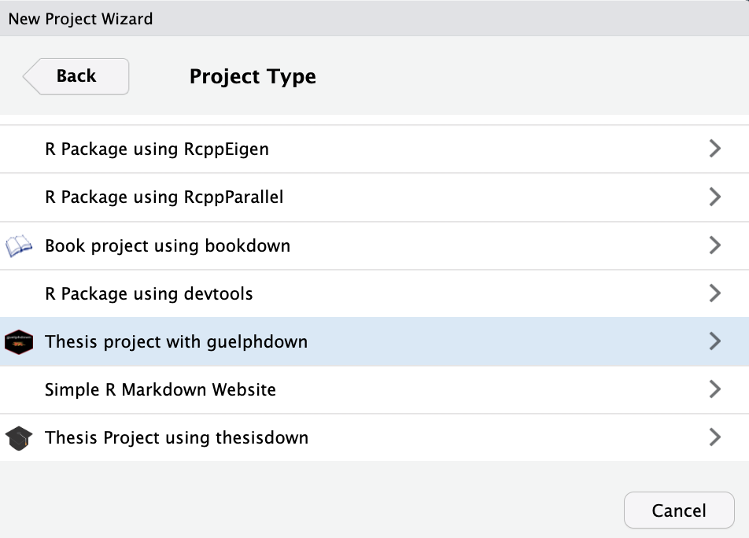
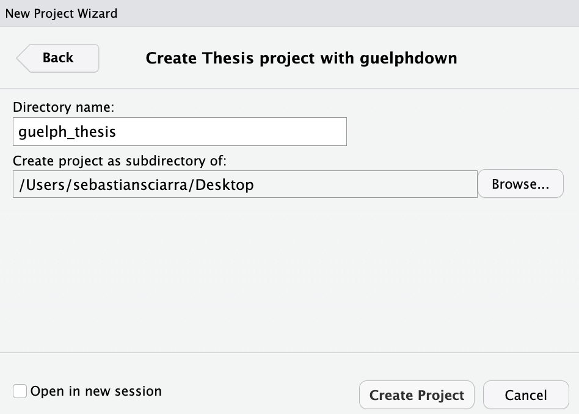

<!-- README.md is generated from README.Rmd. Please edit that file -->

# guelphdown 

This project was inspired by the
[thesisdown](#https://github.com/ismayc/thesisdown/tree/master) package
for writing theses in RStudio and has been created to write theses for
the University of Guelph. LaTeX code has been written in the
`guelphthesis.cls` and `template.tex` files to format the generated
thesis according to the University of Guelph [formatting
requirements](https://graduatestudies.uoguelph.ca/current-students/preparation-your-thesis).
I wrote my thesis using `guelphdown`, which can be viewed
[here](https://atrium.lib.uoguelph.ca/xmlui/bitstream/handle/10214/27543/Sciarra_Sebastian_%20202304_PhD.pdf?sequence=1&isAllowed=y).
Note that `guelphdown` only produces PDF versions of theses. In the
sections that follow, I will explain the following five components to
using `guelphdown`:

1)  Installation
2)  Project creation
3)  YAML header
4)  Creating apa7-formatted figures
5)  Appendix writing

## 1) Installation

Before installing `guelphdown`, two steps must be completed so that
documents in the `guelphdown` can be knit. First, make sure to install
LaTeX, which can be easily accomplished using
[TinyTeX](https://yihui.org/tinytex/).

``` r
install.packages(c('tinytex', 'rmarkdown'))
tinytex::install_tinytex()
# after restarting RStudio, confirm that you have LaTeX with
tinytex:::is_tinytex()
```

Second, install the `bookdown` package.

``` r
install.packages("bookdown")
```

The development version of `guelphdown` can then be installed.

``` r
# install.packages("devtools")
devtools::install_github("sebsciarra/guelphdown")
```

## 2) Project creation

To create a `guelphdown` template, click on **File** \> **New Project**
\> **New Directory**. Then select **Thesis project using guelphdown**
from the dropdown menu as shown below.



THen, give your project a name and specify where you’d like the files to
appear. In the screenshot below, the project name is `guelph_thesis`
will appear as a new folder on the Desktop.



## 3) YAML header

The following code contains the YAML header at the beginning of the
`index.Rmd` file, with comments providing necessary explanations.

``` yaml
title: 'Thesis title'
shorttitle        : "shortitle"
author: 'Author name'
date: 'Date of defence (e.g., April 2023)'
year: 'year'
institution: 'University of Guelph'
advisor: 'Advisor Name'
#altadvisor: 'MJ' 
department: 'Department'
degree: 'Degree'
field: 'Fill if degree is in a field (e.g., Industrial-Organizational Psychology)'
#specialization: 'Statistics'
knit: bookdown::render_book
site: bookdown::bookdown_site
#include any additional LaTeX code
header-includes:
#University of Guelph formatting is only supported pdf output 
output:
  thesisdown::thesis_pdf: 
    pandoc_args: ["--biblatex"]
    includes:
     after_body: ['80-references.Rmd', '81-appendix.Rmd'] #files to be knit and added to the thesis after the references 
# access the content in 00-abstract.Rmd file to print the abstract. 
abstract: '`r if(knitr:::is_latex_output()) paste(readLines(list.files(path = here::here(),pattern = "00--abstract.Rmd", recursive = TRUE, full.names = TRUE)), collapse = "\n  ")`'
# The acknowledgements section can also be accessed like the abstract, or simply printed from the YAML header as shown below. Note that a tab 
# is needed on the line after the `|`.
acknowledgements: |
  [Acknowledgements go here]
dedication: |
 [Dedication goes here] 
#uncomment abbreviations section if necessary
#abbreviations:
#  ABC: American Broadcasting Company
#  CBS: Colombia Broadcasting System
#  CUS: Computer User Services
#  PBS: Public Broadcasting System
# Specify the location of the bibliography below
bibliography: bib/references.bib
lot: true  #list of tables 
lof: true  #list of figures
loa: true  #list of appendices
toc-depth: '5' #header level depth for table of contents
linenumbers: false #whether to put linenumbers in text (effective when making drafts of dissertation)
draft: false #prints 'DRAFT' watermark on pages (useful when making drafts)
ArialFont: false #Times New Roman set as default if false
fontsize: '12pt' #options: 10pt, 11pt, or 12pt (does not have to be wrapped in quotation marks)
linespacing: 2
backref: true #include backreferences
linkcolor: blue #color of all hyperlinks; set to black for print 
print: false #creates print version of thesis with blank pages in preamble
print_refs: false #prints references (useful when drafting); use in conjunction with knit_exit() to stop rendering at any point 
```

## 4) Creating apa7-formatted figures

Given that `guelphdown` followed APA7 formatting guidelines (in
instances where no formatting requirements where specified by the
University of Guelph), I also created a function for generating
apa7-formatted figures. Below, I provide an example. For more
documentation, use `?create_apa7_figure`.

``` r
create_apa7_figure(orientation = "landscape", 
                   samepage = T, 
                   figure_bottom_margin = "0cm", 
                   title = "Depiction of Monte Carlo Method", 
                   figure_tag = "MonteCarlo-comparison", 
                   image_ratio = "0.7", 
                   figure_path = "figures/Monte_Carlo_comparison", 
                   footnote = "Comparison of inferential approach with the Monte Carlo approach. The inferential approach begins with a collected sample and then estimates the population parameter using an appropriate statistical model. The difference between the estimated and population value can be conceptualized as error. Because the population value is generally unknown in the inferential approach, it cannot estimate how much error is introduced by any given methodological or statistical deficiency. To estimate how much error is introduced by any given methodological or statistical deficiency, the Monte Carlo method needs to be used, which constitutes four steps. The Monte Carlo method first defines a population by setting parameter values. Second, many samples are generated from the pre-defined population, with some methodological deficiency built in to each data set (in this case, each sample has a specific amount of missing data). Third, each generated sample is then analyzed and the population estimates of each statistical model are averaged and compared to the pre-determined parameter value. Fourth, the difference between the estimate average and the known population value defines the extent to which the missing data manipulation affected parameter estimation (the difference between the population and average estimated population value is the parameter bias).")
```

## 5) Appendix writing

In the appendix, the numbering for all document elements (i.e.,
equations, figures, tables, etc). changes to a letter-number format
(e.g., Equation A1). To accomplish the letter-numbering format, I added
the following LaTeX code at the beginning of the `81-Appendix.Rmd` file.

``` tex
%change numbering for figures, tables, and equations for appendices
\renewcommand\thefigure{\theapp.\arabic{figure}} %change figure numbering for appendix such that it goes A.1, A.2, etc.
\counterwithin{figure}{app} %reset figure number counter for each appendix

\renewcommand\thetable{\theapp.\arabic{table}} %change figure numbering for appendix such that it goes A.1, A.2, etc.
\counterwithin{table}{app} %reset figure number counter for each appendix

%reset equation number number counter for each appendix
\renewcommand{\theequation}{\theapp.\arabic{equation}}
\counterwithin{equation}{app} %reset figure number counter for each appendix

\counterwithin{chunk}{app} %reset code chunk numbering
```

Because I could not the default method for creating sections (i.e.,
using hashtags), I defined LaTeX functions in the `guelphhesis.cls` file
for creating sections in the appendix. The follogin LaTeX functions can
be inserted in the appendix as needed:

``` tex
1) \app{Level 1 Header}
2) \subapp{Level 2 Header}
3) \subsubapp{Level 3 Header}
4) \paraapp{Level 4 Header}
5) \subparaapp{Level 6 Header}
7) \subsubparaapp{Level 7 Header}
```
